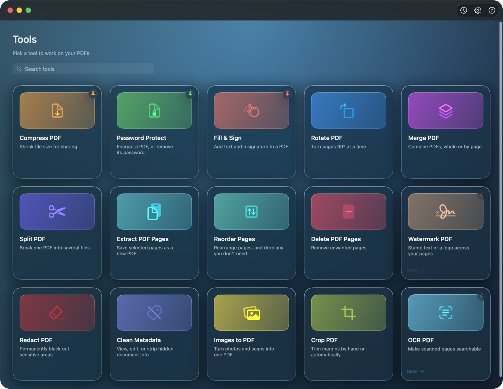

# PDF Utils

[](https://github.com/agirish/pdf-utils/actions/workflows/tests.yml)

A native **macOS** app for everyday PDF work — **15 focused tools** behind a tile-based dashboard, built with **SwiftUI** and **PDFKit**. Everything runs **on your Mac**: no accounts, no uploads, no network calls. You pick input PDFs and save results with the system file dialog.

**🌐 [Browse the full feature tour →](https://agirish.github.io/pdf-utils/)**

<p align="center">
  
</p>

---

## Tools

Tools are grouped on the dashboard into four sections — **Optimize**, **Organize pages**, **Edit & annotate**, and **Secure & clean**.

### Optimize

| Tool | What it does |
|------|--------------|
| **Compress PDF** | Rebuilds each page as an image to reduce file size — best for scans and photos. Pick a compression **strength** or a **target size in MB**. Intrinsic page rotation is flattened into the bitmap (output rotation 0, so it's never double-applied). Add several PDFs to compress a whole batch at once. |
| **OCR PDF** | Runs Apple's on-device text recognition over every page and lays an invisible, selectable text layer behind the scan. The page image is untouched — search, copy, and highlight simply start working. |

### Organize pages

| Tool | What it does |
|------|--------------|
| **Merge PDF** | Stacks several PDFs into one, top-to-bottom in the list. Take only some pages of a file by typing a range in its **Pages** field (e.g. `1, 3-5`); leave blank for all. Reorder rows with the arrows, or drop a stray page straight from the combined preview. |
| **Split PDF** | Cuts one PDF into several — fixed chunks of **N pages**, or **custom ranges** where each comma group (`1-3, 4-6, 7-10`) becomes its own file. Parts are written into a folder you choose. |
| **Extract PDF Pages** | Saves a new PDF of only the pages you list. Order follows what you type (`5,1,2` → page 5, then 1, then 2); ranges expand forward (`3-5`) or backward (`5-3`). |
| **Reorder Pages** | Lists every page as a draggable row; rearrange (drag or **↑ / ↓**), trash any you don't need, and save a new PDF. The preview follows the new order, labeled with each page's original number. |
| **Delete PDF Pages** | Writes a new PDF with the listed pages removed. Requires an explicit list — an empty field does **not** mean "all". At least one page must remain. |
| **Rotate PDF** | Rotates all pages or a **page range** by 90° / 180° / 270°. Batch several PDFs in one run. |

### Edit & annotate

| Tool | What it does |
|------|--------------|
| **Crop PDF** | Tightens each page's margins — type a trim per edge, drag a box directly on the page, or let the tool find the content bounds automatically. Cropping changes what viewers display; nothing is deleted from the page. |
| **Watermark PDF** | Stamps **text** (DRAFT, CONFIDENTIAL, a name) or your own **logo image** across pages. Choose font, color, size, angle, and opacity; a single centered stamp or a tiled pattern; every page, the first page, or a range. The underlying page stays vector (text stays selectable). |
| **Fill & Sign** | Drops typed text onto a non-interactive (flat) form, then draw or type a **signature** and place it. Text stays selectable; the signature is baked in as vector ink. |
| **Images to PDF** | Turns **JPG, PNG, or HEIC** images into one PDF, a page per image. Pick a paper size (or match each image exactly) and whether pictures **fit** inside the page or **fill** it edge to edge. |

### Secure & clean

| Tool | What it does |
|------|--------------|
| **Redact PDF** | ⇧-drag rectangles over sensitive regions — or use **Find & redact** to auto-mark every match of a word or pattern. Marked regions are rebuilt as solid black; text there can't be copied or searched. Irreversible — review before saving. |
| **Password Protect** | Encrypts a PDF behind an open password, or removes a password from one you can already open. Standard PDF encryption, applied on your Mac — the password is never stored or sent anywhere. |
| **Clean Metadata** | Shows what a PDF says about itself — title, author, keywords, producer, dates — then lets you edit any field or strip them all before sharing. Only the info fields are rewritten; the pages are untouched. |

---

## Beyond the tools

- **Batch mode** — drop several PDFs into a whole-document tool (compress, rotate, …) and it runs across every file in one go.
- **Command palette (⌘K)** — a fuzzy-searchable launcher that jumps straight to any tool, Settings, or the activity log.
- **Customizable dashboard** — three layouts (**Categories / Grid / List**), **pin** your most-used tools to the top, drag to reorder tools and whole sections, and a live **search** field.
- **Finder integration** — right-click a PDF in Finder for **Compress**, **Remove Password…**, **Rotate ▸** (Right / Left / 180°), and **Extract Pages…**; select two or more for **Merge**. Handled by a sandboxed Finder extension that hands off to a lightweight menu-bar helper — see below.
- **In-app help (⌘?)** — a built-in help book with per-tool guidance and cross-links.
- **Activity log (⇧⌘L)** — every write is recorded (see below).
- **Liquid-glass UI** — a tunable translucent look with light / dark / system theming.

## Appearance & settings

Open **Settings** (⌘,) to tune the app across three tabs:

- **Appearance** — **Theme** (Light / Dark / System, applied via `NSApplication.appearance` so it also reaches the title bar, open/save panels, and alerts), **Dashboard layout**, **Accent color**, **Tool colors** (multicolor or monochrome), **Glass effect** (clear → frosted → solid), **Tint**, **Content surface** (cards or unified), and tool preview-pane backgrounds.
- **Files** — what to do **after exporting** (reveal in Finder / open the file), and whether to **reopen the last tool** on launch instead of the dashboard.
- **Advanced** — default compression quality, **strip metadata on export**, clear pinned tools, reset dashboard order, and reset all settings.

## Activity log

Every operation that writes a file is recorded, so you can see exactly what the app did — and hand a clean trace to a bug report. Open it from the toolbar **clock** button, **Help ▸ Activity Log**, or **⇧⌘L**; it opens in its own window.

- Each **merge, split, extract, reorder, delete-pages, rotate, compress, watermark, protect, redact, crop, OCR, images-to-PDF, fill-&-sign,** and **metadata** action logs an entry when you save — with the destination path and file size — and failures are logged too. Cancelling a Save dialog records nothing.
- Entries are grouped by day, filterable by level (**All / Info / Warnings / Errors**) with live counts and a message search, and can be **copied** or **cleared**.
- History is written to **`~/pdf-utils.log`** and survives quitting: **Show older history** loads earlier sessions, and the toolbar's document button reveals the file in Finder.

## Privacy

- **No network calls; no analytics** in this codebase. Nothing leaves your Mac — the activity log is a local file (`~/pdf-utils.log`).
- Uses **security-scoped** access from the file importer for the files you choose. If macOS denies access, the app shows a clear error instead of a generic open failure.
- Heavy work runs **off the main thread** so the UI stays responsive on large files.

### Page-range syntax

- Comma-separated: `1, 3, 5`
- Inclusive ranges: `3-7`
- Mix: `1, 4-6, 10`

Numbers are **1-based**, matching the page labels in Preview. **Extract** keeps the order you type; **Rotate** and **Delete** treat ranges as a set of unique pages. **Extract** / **Rotate (range)** treat a blank field as "all pages"; **Delete** does not.

---

## Requirements

- **macOS 15** or later (SwiftUI / PDFKit APIs used here).
- **Xcode 16+** recommended to open the Swift package.

## Build & run

The app is built with **Swift Package Manager** (not an Xcode project — it relies on `Bundle.module`, which only exists under SwiftPM).

From Xcode:

1. Open **`Package.swift`** (**File → Open…**).
2. Select the **`PdfUtils`** scheme (executable).
3. **Run** (⌘R).

From a terminal:

```bash
swift build
swift run PdfUtils        # launches the GUI
```

### Assemble an installable `.app`

`swift build` produces a bare executable. To assemble a full **`PDF Utils.app`** — with the Finder Sync extension and the login-item menu-bar helper nested and code-signed — run:

```bash
scripts/build-app.sh          # → build/PDF Utils.app  (ad-hoc signed)
```

Then copy `build/PDF Utils.app` to `/Applications` and launch it.

### Run the tests

Tests live in the sub-package:

```bash
swift test --package-path Packages/PdfToolkit
```

## Repository layout

```
Package.swift              # Swift package for the app — open this in Xcode
MacApp/                    # App target: entry point, dashboard, root shell, assets
Packages/PdfToolkit/       # Shared library: tool UIs, PDF operations, settings, help
  Sources/PdfToolkit/
  Tests/PdfToolkitTests/   # The test suite (run with --package-path)
FinderExtension/           # Sandboxed FinderSync extension (right-click menu)
Helper/                    # Unsandboxed menu-bar helper the extension hands work to
scripts/build-app.sh       # Assembles + signs the full .app bundle
docs/                      # GitHub Pages site + screenshots
```

### Architecture note — Finder integration

A FinderSync extension must be sandboxed, and a sandboxed extension can see the selected file paths but can't read or write them. So the extension does no PDF work: it writes the requested `{action, paths}` to a command file and pings a resident, unsandboxed **menu-bar helper** (embedded as a login item) that reuses `PdfToolkit` to do the work and reveals the result in Finder.

## License

Add a `LICENSE` file when you decide how to distribute this project.
